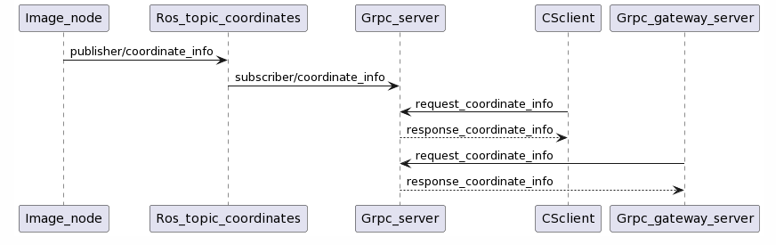

# GrpcServer

Workspace de ros2 que implementa un servidor grpc en python, un cliente en c# y un servidor grpc-gateway para obtener datos publicados en un tópico de ROS, este workspace se puede usar para obtener usando HTTP datos publicados en un tópico. Use, modifique y refactorice el código como usted desee.

Para compilar el proyecto hacer colcon build -> source/install.setup.bash (se usa ros2)

# Archivos a ejecutar:
1) Image.py -> ros2 run interfaces image.py
2) Grpc-server.py -> ros2 run interfaces grpc_server.py
3) program.cs -> dotnet run (en la carpeta de scripts)
4) gateway.go -> go run gateway.go

# Docs
La documentacion del proyecto se hizo usando doxygen, se puede encontrar corriendo el archivo index.html encontrado en src/interfases/html

